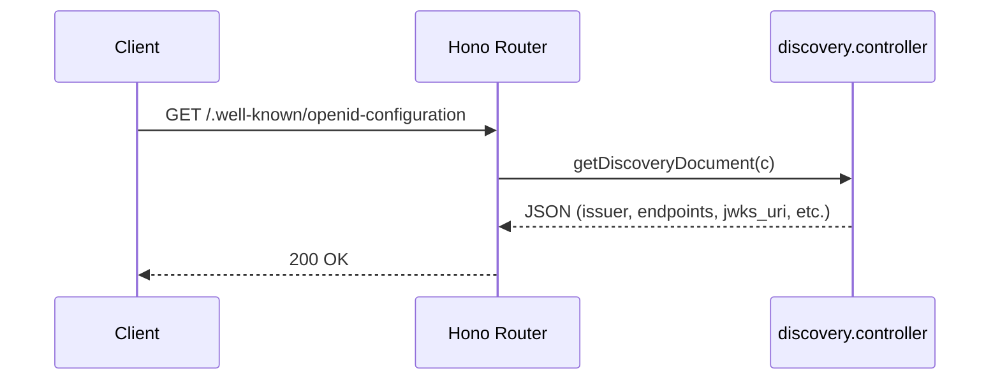

# Discovery Function Calls

```mermaid
sequenceDiagram
    participant Client
    participant Hono as Hono Router
    participant Controller as discovery.controller
    
    Client->>Hono: GET /.well-known/openid-configuration
    Hono->>Controller: getDiscoveryDocument(c)
    Controller-->>Hono: JSON (issuer, endpoints, jwks_uri, etc.)
    Hono-->>Client: 200 OK
```
