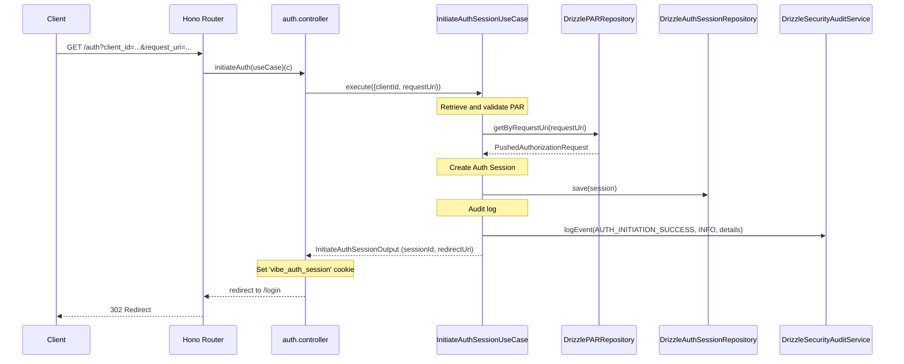

# Initiate Auth Function Calls

```mermaid
sequenceDiagram
    participant Client
    participant Hono as Hono Router
    participant Controller as auth.controller
    participant UseCase as InitiateAuthSessionUseCase
    participant PARRepo as DrizzlePARRepository
    participant SessionRepo as DrizzleAuthSessionRepository
    participant Audit as DrizzleSecurityAuditService
    
    Client->>Hono: GET /auth?client_id=...&request_uri=...
    Hono->>Controller: initiateAuth(useCase)(c)
    Controller->>UseCase: execute({clientId, requestUri})
    
    Note over UseCase: Retrieve and validate PAR
    UseCase->>PARRepo: getByRequestUri(requestUri)
    PARRepo-->>UseCase: PushedAuthorizationRequest
    
    Note over UseCase: Create Auth Session
    UseCase->>SessionRepo: save(session)
    
    Note over UseCase: Audit log
    UseCase->>Audit: logEvent(AUTH_INITIATION_SUCCESS, INFO, details)
    
    UseCase-->>Controller: InitiateAuthSessionOutput (sessionId, redirectUri)
    
    Note over Controller: Set 'vibe_auth_session' cookie
    Controller-->>Hono: redirect to /login
    Hono-->>Client: 302 Redirect
```
