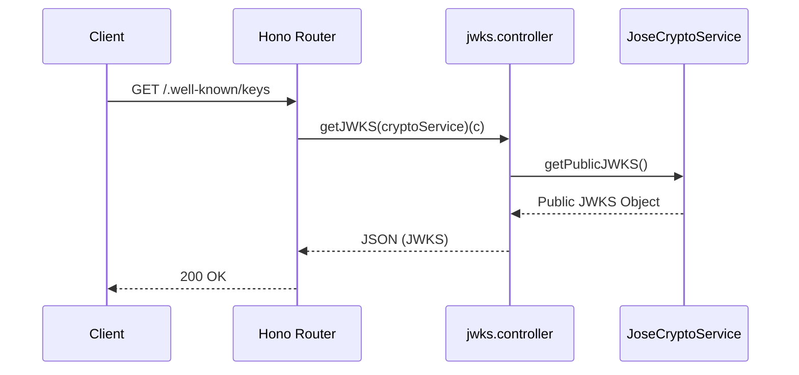

# JWKS Function Calls

```mermaid
sequenceDiagram
    participant Client
    participant Hono as Hono Router
    participant Controller as jwks.controller
    participant Crypto as JoseCryptoService
    
    Client->>Hono: GET /.well-known/keys
    Hono->>Controller: getJWKS(cryptoService)(c)
    Controller->>Crypto: getPublicJWKS()
    Crypto-->>Controller: Public JWKS Object
    Controller-->>Hono: JSON (JWKS)
    Hono-->>Client: 200 OK
```
