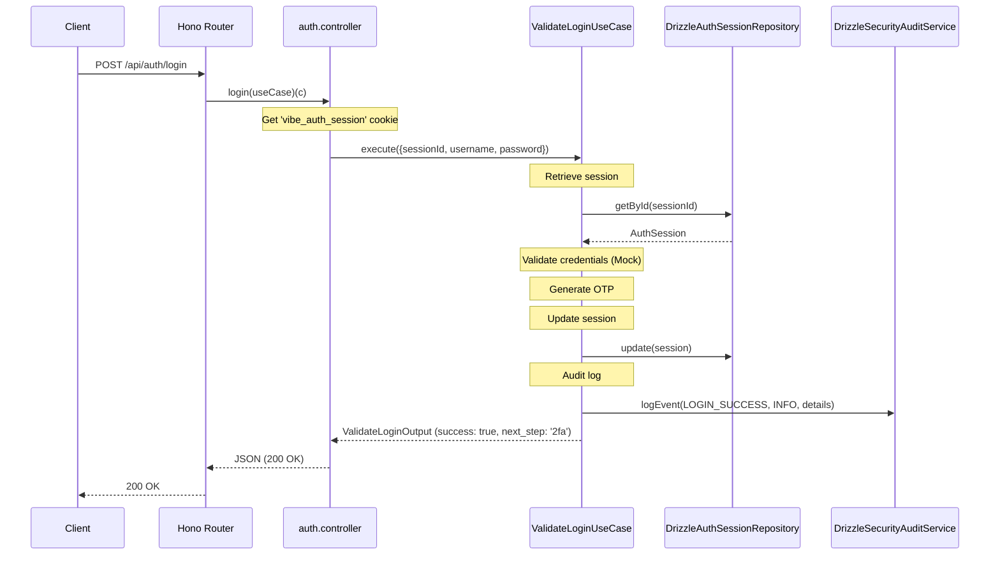

# Login Function Calls

```mermaid
sequenceDiagram
    participant Client
    participant Hono as Hono Router
    participant Controller as auth.controller
    participant UseCase as ValidateLoginUseCase
    participant SessionRepo as DrizzleAuthSessionRepository
    participant Audit as DrizzleSecurityAuditService
    
    Client->>Hono: POST /api/auth/login
    Hono->>Controller: login(useCase)(c)
    
    Note over Controller: Get 'vibe_auth_session' cookie
    Controller->>UseCase: execute({sessionId, username, password})
    
    Note over UseCase: Retrieve session
    UseCase->>SessionRepo: getById(sessionId)
    SessionRepo-->>UseCase: AuthSession
    
    Note over UseCase: Validate credentials (Mock)
    
    Note over UseCase: Generate OTP
    
    Note over UseCase: Update session
    UseCase->>SessionRepo: update(session)
    
    Note over UseCase: Audit log
    UseCase->>Audit: logEvent(LOGIN_SUCCESS, INFO, details)
    
    UseCase-->>Controller: ValidateLoginOutput (success: true, next_step: '2fa')
    Controller-->>Hono: JSON (200 OK)
    Hono-->>Client: 200 OK
```
