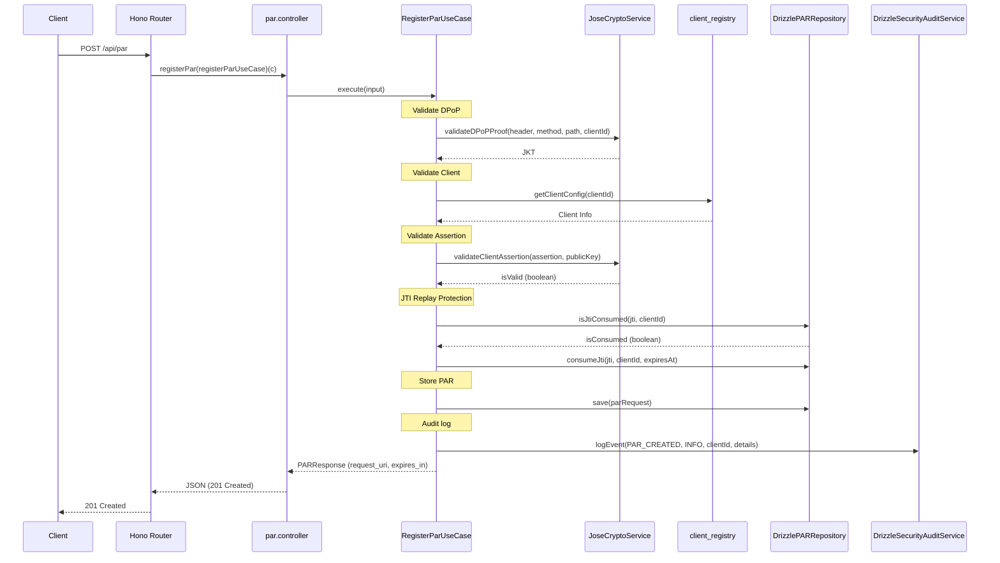

# PAR Function Calls

```mermaid
sequenceDiagram
    participant Client
    participant Hono as Hono Router
    participant Controller as par.controller
    participant UseCase as RegisterParUseCase
    participant Crypto as JoseCryptoService
    participant Registry as client_registry
    participant PARRepo as DrizzlePARRepository
    participant Audit as DrizzleSecurityAuditService
    
    Client->>Hono: POST /api/par
    Hono->>Controller: registerPar(registerParUseCase)(c)
    Controller->>UseCase: execute(input)
    
    Note over UseCase: Validate DPoP
    UseCase->>Crypto: validateDPoPProof(header, method, path, clientId)
    Crypto-->>UseCase: JKT
    
    Note over UseCase: Validate Client
    UseCase->>Registry: getClientConfig(clientId)
    Registry-->>UseCase: Client Info
    
    Note over UseCase: Validate Assertion
    UseCase->>Crypto: validateClientAssertion(assertion, publicKey)
    Crypto-->>UseCase: isValid (boolean)
    
    Note over UseCase: JTI Replay Protection
    UseCase->>PARRepo: isJtiConsumed(jti, clientId)
    PARRepo-->>UseCase: isConsumed (boolean)
    UseCase->>PARRepo: consumeJti(jti, clientId, expiresAt)
    
    Note over UseCase: Store PAR
    UseCase->>PARRepo: save(parRequest)
    
    Note over UseCase: Audit log
    UseCase->>Audit: logEvent(PAR_CREATED, INFO, clientId, details)
    
    UseCase-->>Controller: PARResponse (request_uri, expires_in)
    Controller-->>Hono: JSON (201 Created)
    Hono-->>Client: 201 Created
```
