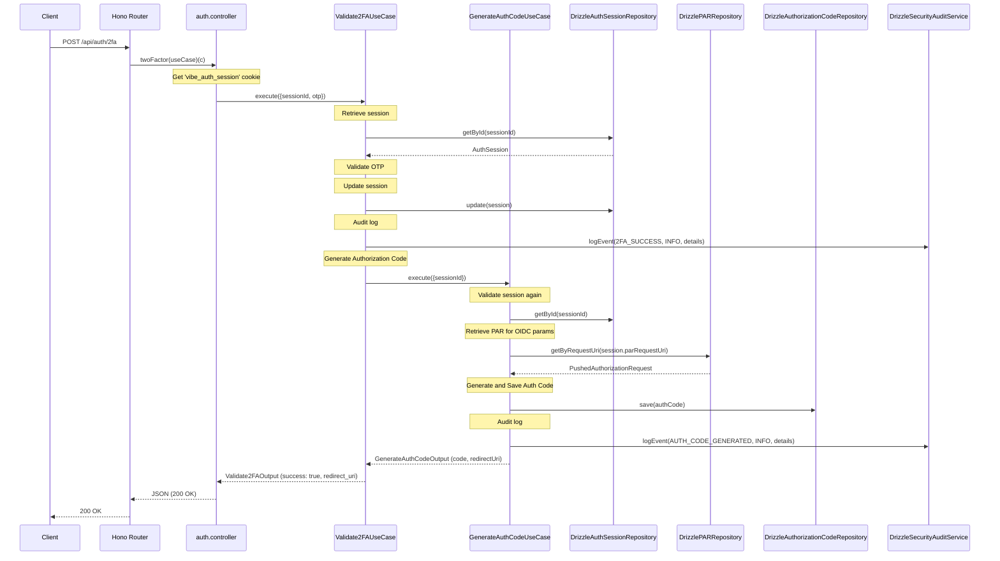

# 2FA Function Calls

```mermaid
sequenceDiagram
    participant Client
    participant Hono as Hono Router
    participant Controller as auth.controller
    participant UseCase2FA as Validate2FAUseCase
    participant UseCaseAuthCode as GenerateAuthCodeUseCase
    participant SessionRepo as DrizzleAuthSessionRepository
    participant PARRepo as DrizzlePARRepository
    participant AuthCodeRepo as DrizzleAuthorizationCodeRepository
    participant Audit as DrizzleSecurityAuditService
    
    Client->>Hono: POST /api/auth/2fa
    Hono->>Controller: twoFactor(useCase)(c)
    
    Note over Controller: Get 'vibe_auth_session' cookie
    Controller->>UseCase2FA: execute({sessionId, otp})
    
    Note over UseCase2FA: Retrieve session
    UseCase2FA->>SessionRepo: getById(sessionId)
    SessionRepo-->>UseCase2FA: AuthSession
    
    Note over UseCase2FA: Validate OTP
    
    Note over UseCase2FA: Update session
    UseCase2FA->>SessionRepo: update(session)
    
    Note over UseCase2FA: Audit log
    UseCase2FA->>Audit: logEvent(2FA_SUCCESS, INFO, details)
    
    Note over UseCase2FA: Generate Authorization Code
    UseCase2FA->>UseCaseAuthCode: execute({sessionId})
    
    Note over UseCaseAuthCode: Validate session again
    UseCaseAuthCode->>SessionRepo: getById(sessionId)
    
    Note over UseCaseAuthCode: Retrieve PAR for OIDC params
    UseCaseAuthCode->>PARRepo: getByRequestUri(session.parRequestUri)
    PARRepo-->>UseCaseAuthCode: PushedAuthorizationRequest
    
    Note over UseCaseAuthCode: Generate and Save Auth Code
    UseCaseAuthCode->>AuthCodeRepo: save(authCode)
    
    Note over UseCaseAuthCode: Audit log
    UseCaseAuthCode->>Audit: logEvent(AUTH_CODE_GENERATED, INFO, details)
    
    UseCaseAuthCode-->>UseCase2FA: GenerateAuthCodeOutput (code, redirectUri)
    UseCase2FA-->>Controller: Validate2FAOutput (success: true, redirect_uri)
    Controller-->>Hono: JSON (200 OK)
    Hono-->>Client: 200 OK
```
