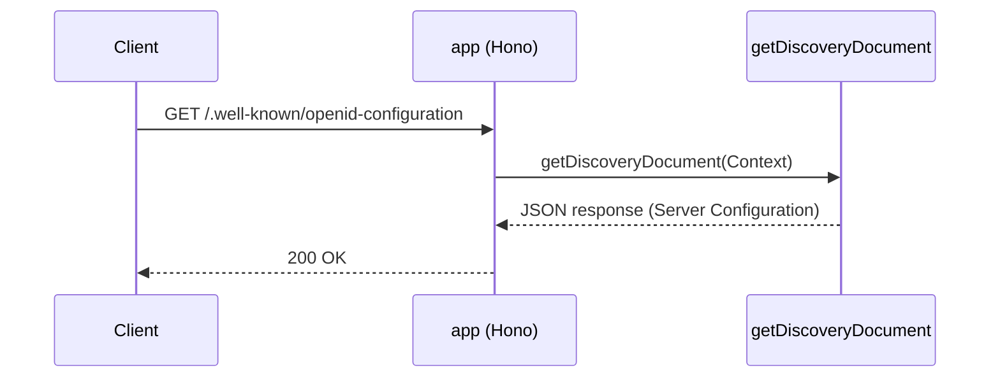

# Discovery Endpoint Function Call Flow

This diagram illustrates the function call flow when a client requests the OpenID Configuration Discovery document.

```mermaid
sequenceDiagram
    participant Client
    participant HonoApp as app (Hono)
    participant DiscoveryController as getDiscoveryDocument
    
    Client->>HonoApp: GET /.well-known/openid-configuration
    HonoApp->>DiscoveryController: getDiscoveryDocument(Context)
    DiscoveryController-->>HonoApp: JSON response (Server Configuration)
    HonoApp-->>Client: 200 OK
```
