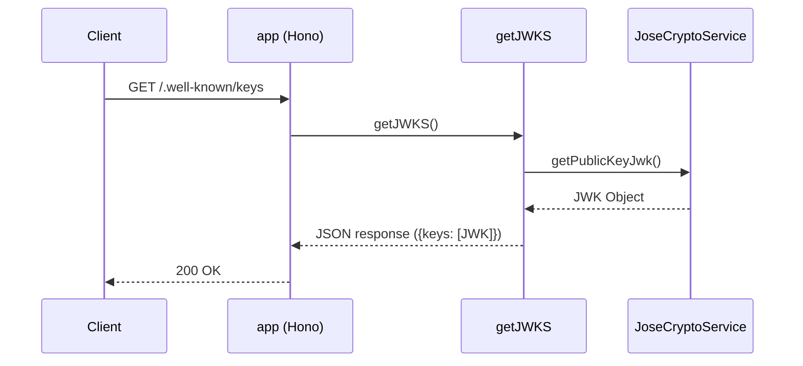

# JWKS Endpoint Function Call Flow

This diagram illustrates the function call flow when a client requests the JSON Web Key Set (JWKS) to verify signatures from this identity provider.

```mermaid
sequenceDiagram
    participant Client
    participant HonoApp as app (Hono)
    participant JwksController as getJWKS
    participant CryptoService as JoseCryptoService
    
    Client->>HonoApp: GET /.well-known/keys
    HonoApp->>JwksController: getJWKS()
    JwksController->>CryptoService: getPublicKeyJwk()
    CryptoService-->>JwksController: JWK Object
    JwksController-->>HonoApp: JSON response ({keys: [JWK]})
    HonoApp-->>Client: 200 OK
```
