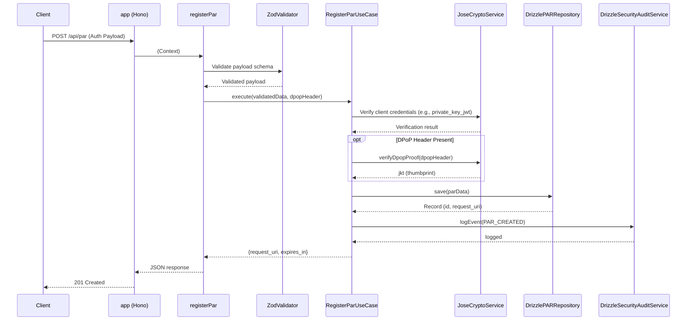

# Pushed Authorization Request (PAR) Endpoint Flow

This diagram illustrates the function call flow when a relying party sends an authorization request via the backchannel PAR endpoint.

```mermaid
sequenceDiagram
    participant Client
    participant HonoApp as app (Hono)
    participant ParController as registerPar
    participant Validator as ZodValidator
    participant ParUseCase as RegisterParUseCase
    participant CryptoService as JoseCryptoService
    participant ParRepo as DrizzlePARRepository
    participant AuditService as DrizzleSecurityAuditService
    
    Client->>HonoApp: POST /api/par (Auth Payload)
    HonoApp->>ParController: (Context)
    ParController->>Validator: Validate payload schema
    Validator-->>ParController: Validated payload
    ParController->>ParUseCase: execute(validatedData, dpopHeader)

    %% Client Credential Validation
    ParUseCase->>CryptoService: Verify client credentials (e.g., private_key_jwt)
    CryptoService-->>ParUseCase: Verification result
    
    %% Optional DPoP Verification
    opt DPoP Header Present
        ParUseCase->>CryptoService: verifyDpopProof(dpopHeader)
        CryptoService-->>ParUseCase: jkt (thumbprint)
    end

    %% State Persistence
    ParUseCase->>ParRepo: save(parData)
    ParRepo-->>ParUseCase: Record (id, request_uri)
    
    %% Audit Logging
    ParUseCase->>AuditService: logEvent(PAR_CREATED)
    AuditService-->>ParUseCase: logged
    
    %% Result
    ParUseCase-->>ParController: {request_uri, expires_in}
    ParController-->>HonoApp: JSON response
    HonoApp-->>Client: 201 Created
```
