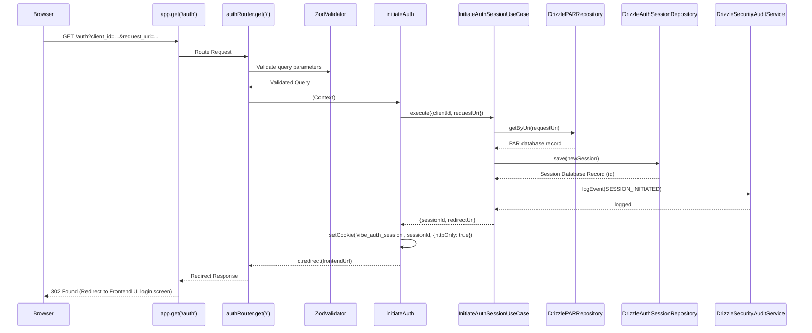

# Auth Initiation Flow

This diagram illustrates the function call flow when a user's browser is redirected to the Authorization Server (`/auth`) after a successful PAR request.

```mermaid
sequenceDiagram
    participant Browser
    participant HonoApp as app.get('/auth')
    participant AuthRouter as authRouter.get('/')
    participant Validator as ZodValidator
    participant AuthController as initiateAuth
    participant AuthUseCase as InitiateAuthSessionUseCase
    participant ParRepo as DrizzlePARRepository
    participant SessionRepo as DrizzleAuthSessionRepository
    participant AuditService as DrizzleSecurityAuditService
    
    Browser->>HonoApp: GET /auth?client_id=...&request_uri=...
    HonoApp->>AuthRouter: Route Request
    AuthRouter->>Validator: Validate query parameters
    Validator-->>AuthRouter: Validated Query
    AuthRouter->>AuthController: (Context)
    
    %% Use Case Execution
    AuthController->>AuthUseCase: execute({clientId, requestUri})
    
    %% PAR Validation
    AuthUseCase->>ParRepo: getByUri(requestUri)
    ParRepo-->>AuthUseCase: PAR database record
    
    %% Note: Validates client_id matches the one in PAR payload
    
    %% Session Creation
    AuthUseCase->>SessionRepo: save(newSession)
    SessionRepo-->>AuthUseCase: Session Database Record (id)
    
    %% Audit Logging
    AuthUseCase->>AuditService: logEvent(SESSION_INITIATED)
    AuditService-->>AuthUseCase: logged
    
    %% Result
    AuthUseCase-->>AuthController: {sessionId, redirectUri}
    
    %% Cookie and Redirect
    AuthController->>AuthController: setCookie('vibe_auth_session', sessionId, {httpOnly: true})
    AuthController-->>AuthRouter: c.redirect(frontendUrl)
    AuthRouter-->>HonoApp: Redirect Response
    HonoApp-->>Browser: 302 Found (Redirect to Frontend UI login screen)
```
