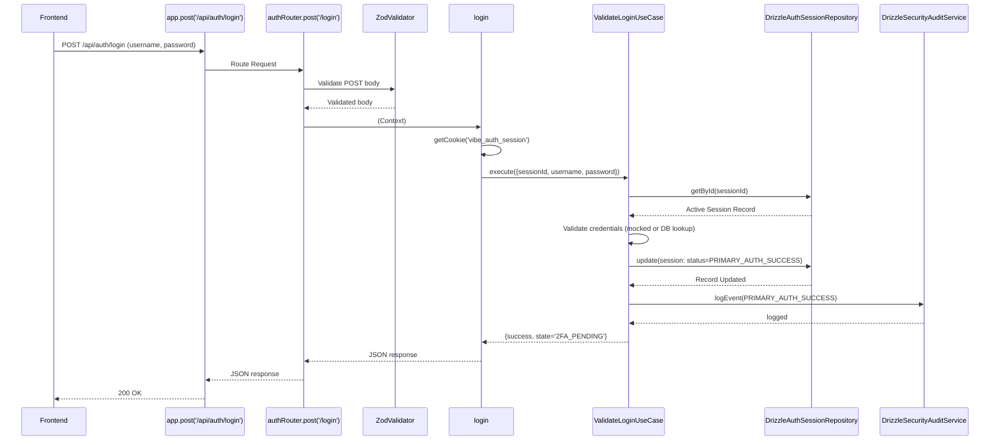

# Primary Login Endpoint Flow

This diagram illustrates the function call flow when a user submits their initial credentials (e.g., username/NRIC and password) to the primary login RPC endpoint.

```mermaid
sequenceDiagram
    participant Frontend
    participant HonoApp as app.post('/api/auth/login')
    participant AuthRouter as authRouter.post('/login')
    participant Validator as ZodValidator
    participant AuthController as login
    participant LoginUseCase as ValidateLoginUseCase
    participant SessionRepo as DrizzleAuthSessionRepository
    participant AuditService as DrizzleSecurityAuditService
    
    Frontend->>HonoApp: POST /api/auth/login (username, password)
    HonoApp->>AuthRouter: Route Request
    AuthRouter->>Validator: Validate POST body
    Validator-->>AuthRouter: Validated body
    AuthRouter->>AuthController: (Context)
    
    %% Session retrieval
    AuthController->>AuthController: getCookie('vibe_auth_session')
    AuthController->>LoginUseCase: execute({sessionId, username, password})
    
    %% Validate Session
    LoginUseCase->>SessionRepo: getById(sessionId)
    SessionRepo-->>LoginUseCase: Active Session Record
    
    %% Validate Credentials
    LoginUseCase->>LoginUseCase: Validate credentials (mocked or DB lookup)
    
    %% Update Session State
    LoginUseCase->>SessionRepo: update(session: status=PRIMARY_AUTH_SUCCESS)
    SessionRepo-->>LoginUseCase: Record Updated
    
    %% Audit Logging
    LoginUseCase->>AuditService: logEvent(PRIMARY_AUTH_SUCCESS)
    AuditService-->>LoginUseCase: logged
    
    %% Result
    LoginUseCase-->>AuthController: {success, state='2FA_PENDING'}
    AuthController-->>AuthRouter: JSON response
    AuthRouter-->>HonoApp: JSON response
    HonoApp-->>Frontend: 200 OK
```
