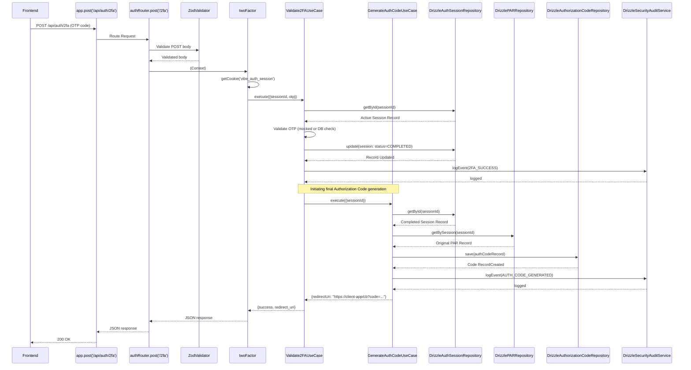

# 2FA / OTP Verification Endpoint Flow

This diagram illustrates the function call flow when a user submits their secondary verification factor (e.g., OTP), completing the login flow and triggering the issuance of an authorization code.

