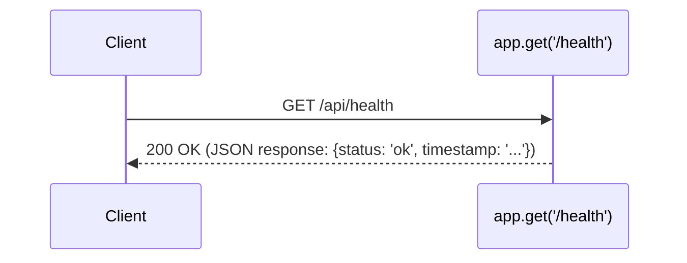

# Health Check Endpoint Flow

This diagram illustrates the very simplistic flow for the health check API.

```mermaid
sequenceDiagram
    participant Client
    participant HonoApp as app.get('/health')
    
    Client->>HonoApp: GET /api/health
    HonoApp-->>Client: 200 OK (JSON response: {status: 'ok', timestamp: '...'})
```
