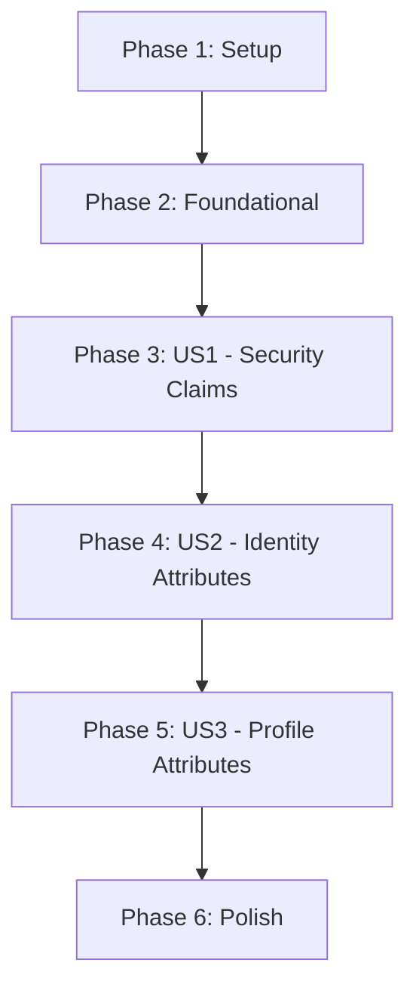

# Tasks: ID Token Missing Claims

**Feature**: [ID Token Missing Claims](../spec.md)
**Plan**: [Implementation Plan](../plan.md)
**Branch**: `015-id-token-claims`

## Implementation Strategy

We will follow an incremental delivery approach, starting with the mandatory security claims (US1) as the MVP. Database schema changes are prioritized in the foundational phase to enable persistence of authentication context (LOA and AMR). Each user story will be implemented as a self-contained increment with its own tests.

## Dependency Graph

## Phase 1: Setup

Goal: Initialize testing environment.

- [X] T001 [P] Setup test file for claims mapping in `apps/backend/tests/core/claims.test.ts`

## Phase 2: Foundational

Goal: Update data models and persistence layers to support authentication context.

- [X] T002 Update database schema in `apps/backend/src/infra/database/schema.ts` to add `amr` to `sessions` and `loa`, `amr` to `access_tokens`
- [X] T003 Update `Session` and `AuthCodeSessionData` interfaces in `apps/backend/src/core/domain/auth_data_service.ts` to include `amr: string[]`
- [X] T004 Update `DrizzleAuthDataService.updateSession` in `apps/backend/src/infra/adapters/drizzle_auth_data.ts` to persist `amr` array as stringified JSON
- [X] T005 Update `DrizzleTokenRepository.saveAccessToken` in `apps/backend/src/infra/adapters/db/drizzle_token_repository.ts` to persist `loa` and `amr` from the exchange context
- [X] T006 [P] Create claim mapping utility skeleton and base types in `apps/backend/src/core/domain/claims.ts`

## Phase 3: User Story 1 - Mandatory Security Claims (P1)

Goal: Include `acr`, `amr`, and `sub_type` in ID Tokens and UserInfo responses.

- [X] T007 [P] [US1] Create unit tests for `acr`, `amr`, and `sub_type` mapping in `apps/backend/tests/core/claims.test.ts`
- [X] T010 [US1] Implement mapping logic for `acr` URIs and `sub_type` in `apps/backend/src/core/domain/claims.ts`
- [X] T011 [US1] Update `TokenService.generateIdToken` in `apps/backend/src/core/application/services/token.service.ts` to include `acr`, `amr`, and `sub_type` claims
- [X] T012 [US1] Update `TokenExchangeUseCase.execute` in `apps/backend/src/core/use-cases/token-exchange.ts` to propagate `loa` and `amr` from the auth code session to `tokenService.generateTokens`
- [X] T013 [US1] Update `GetUserInfoUseCase.execute` in `apps/backend/src/core/use-cases/get-userinfo.ts` to include `acr`, `amr`, and `sub_type` using values stored in the access token record

## Phase 4: User Story 2 - Identity Attributes (P2)

Goal: Include `sub_attributes` for `user.identity` scope.

- [X] T014 [P] [US2] Add unit tests for `user.identity` scope mapping in `apps/backend/tests/core/claims.test.ts`
- [X] T015 [US2] Implement `sub_attributes` builder for `identity_number` (NRIC), `identity_coi` (SG), and `account_type` (standard) in `apps/backend/src/core/domain/claims.ts`
- [X] T016 [US2] Update `TokenService.generateIdToken` to conditionally include `sub_attributes` based on authorized scopes
- [X] T017 [US2] Update `GetUserInfoUseCase.execute` to conditionally include `sub_attributes` based on authorized scopes

## Phase 5: User Story 3 - Personal Profile Attributes (P3)

Goal: Extend `sub_attributes` for `name`, `email`, and `mobileno` scopes.

- [X] T018 [P] [US3] Add unit tests for `name`, `email`, and `mobileno` scope mapping in `apps/backend/tests/core/claims.test.ts`
- [X] T019 [US3] Implement mapping for profile attributes in the `sub_attributes` builder in `apps/backend/src/core/domain/claims.ts`
- [X] T020 [US3] Implement multi-scope merging logic to ensure `sub_attributes` contains the union of all authorized fields in `apps/backend/src/core/domain/claims.ts`

## Phase 6: Polish & Cross-Cutting Concerns

Goal: Final validation and compliance check.

- [X] T021 [P] Verify ID Token and UserInfo response payloads against contracts in `specs/015-id-token-claims/contracts/`
- [X] T022 Run full backend test suite to ensure no regressions and verify code coverage >= 80%

## Parallel Execution Examples

- **Foundational Development**: T001 and T006 can be started in parallel as they set up independent parts of the infra.
- **Claim Mapping Logic**: All unit tests (T007, T014, T018) can be written in parallel once T001 is complete.
- **Independent Scopes**: Mapping for US2 (T013) and US3 (T019) can be developed in parallel within the `claims.ts` utility.
