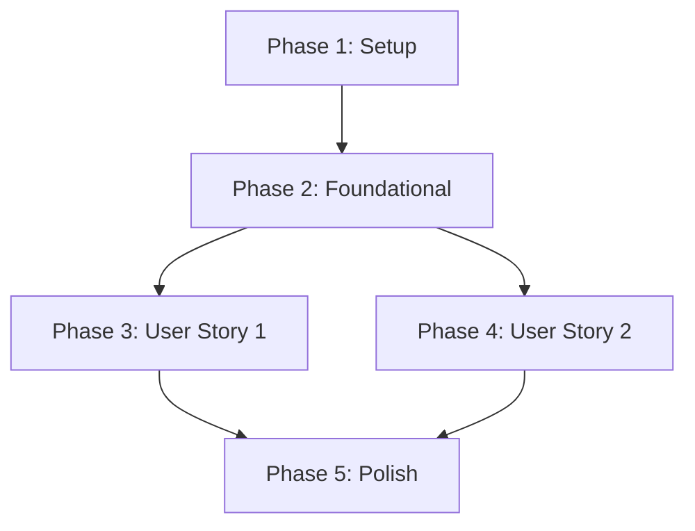

# Tasks: DPoP Validator Consolidation

**Feature**: DPoP Validator Consolidation
**Status**: Ready for Implementation
**Branch**: `020-dpop-consolidation`

## Phase 1: Setup

- [ ] T001 Verify project environment and dependencies in `apps/backend/package.json`
- [ ] T002 Ensure `DrizzleJtiStore` is correctly exported and accessible in `apps/backend/src/infra/adapters/db/drizzle_jti_store.ts`

## Phase 2: Foundational (DPoP Validator Refinement)

**Goal**: Ensure `DPoPValidator` implements the strictest possible validation logic according to the new contracts.

- [ ] T003 [P] Add comprehensive test suite for strict `htu` and `jti` validation in `apps/backend/tests/unit/dpop_validator.test.ts`
- [ ] T004 Refine `htu` matching logic in `apps/backend/src/core/utils/dpop_validator.ts` to ensure exact string matching post-normalization
- [ ] T005 Verify `jti` replay window logic in `apps/backend/src/core/utils/dpop_validator.ts` matches requirements (±120s tolerance)

## Phase 3: User Story 1 - Secure Token Exchange with DPoP (Priority: P1)

**Goal**: Migrate PAR and Token Exchange to use the unified `DPoPValidator` with strict checks.

**Independent Test**: Attempt PAR and Token Exchange with mismatched `htu` or reused `jti`; verify strict rejection.

- [ ] T006 [P] [US1] Add integration test for PAR DPoP validation in `apps/backend/tests/infra/http/par_dpop.test.ts`
- [ ] T007 [P] [US1] Add integration test for Token Exchange DPoP validation in `apps/backend/tests/infra/http/token_dpop.test.ts`
- [ ] T008 [US1] Update `RegisterParUseCase` to inject and use `DPoPValidator` instead of `CryptoService.validateDPoPProof` in `apps/backend/src/core/use-cases/register-par.ts`
- [ ] T009 [US1] Update dependency injection for `RegisterParUseCase` to include `DPoPValidator` in `apps/backend/src/index.ts`
- [ ] T010 [US1] Verify `TokenExchangeUseCase` uses the refined `DPoPValidator` correctly in `apps/backend/src/core/use-cases/token-exchange.ts`

## Phase 4: User Story 2 - Consistent Security across OIDC Endpoints (Priority: P2)

**Goal**: Migrate UserInfo and perform final code cleanup by removing redundant implementation.

**Independent Test**: Verify UserInfo endpoint consistently rejects invalid proofs using the same logic as other endpoints.

- [ ] T011 [P] [US2] Add integration test for UserInfo DPoP validation in `apps/backend/tests/infra/http/userinfo_dpop.test.ts`
- [ ] T012 [US2] Verify `GetUserInfoUseCase` uses the unified `DPoPValidator` correctly in `apps/backend/src/core/use-cases/get-userinfo.ts`
- [ ] T013 [US2] Remove `validateDPoPProof` method from the `CryptoService` interface in `apps/backend/src/core/domain/crypto_service.ts`
- [ ] T014 [US2] Remove `validateDPoPProof` implementation from `JoseCryptoService` in `apps/backend/src/infra/adapters/jose_crypto.ts`
- [ ] T015 [US2] Delete or ensure removal of legacy `apps/backend/src/core/utils/dpop.ts`

## Phase 5: Polish & Verification

- [ ] T016 Run all DPoP related tests across the monorepo using `bun test`
- [ ] T017 Verify zero occurrences of `validateDPoPProof` remain in the source code using `grep`
- [ ] T018 Perform final code review for KISS/DRY compliance in `apps/backend/src/core/utils/dpop_validator.ts`

## Dependency Graph

## Parallel Execution Examples

### User Story 1 (Phase 3)
- `T006` and `T007` (Integration tests) can be implemented in parallel.

### User Story 2 (Phase 4)
- `T011` (Integration test) and `T013`/`T014`/`T015` (Cleanup) can be performed in parallel once US1 is verified.

## Implementation Strategy

1. **Foundational (MVP)**: Update `DPoPValidator` and its unit tests. This ensures the core logic is correct before updating any consumers.
2. **Critical Flow (US1)**: Refactor PAR and Token Exchange. These are the entry points for DPoP-bound tokens.
3. **Consistency (US2)**: Refactor UserInfo and clean up the legacy `CryptoService` bridge.
4. **Finalization**: Verify all endpoints respond identically to security violations.
